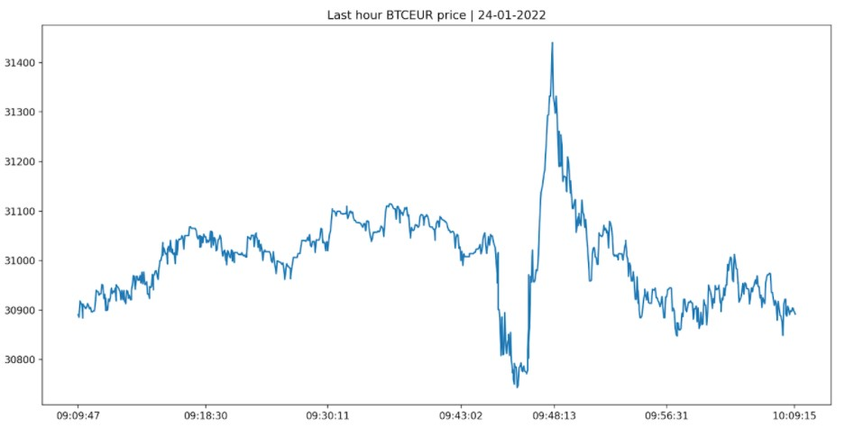

# Implementation of Bitstamp API

The Bitstamp project provides the user important information about daily
price movements and volume which can be utilized to gain insight into the
desired cryptocurrency. Data is provided by the Bitstamp API (full 
documentation at https://www.bitstamp.net/api/) and can be converted into
the available currencies.

The main functionalities include: 

- real time price;
- 24 hours average volume;
- daily % change;
- line chart of the last-hour price. 

## Installation

Use the command `git clone https://github.com/mattiacostacurta/bitstamp.git` in the command prompt of your PC in order to automatically download the whole folder containing the modules used. 
Git should have been previously installed on the machine. 
In alternative, just download manually the package from Github.

Moreover, some additional libraries/modules are required to run our project on the terminal are: 

- json
- request 
- pandas
- argparse
- matplotlib.pyplot
- currencyconverter
- datetime, 
- unittest
- sys
- os
- math

If these libraries/modules are not already installed in your pc, you can install them using the following command.

For example: 
```bash
pip install 'library/module name'
```

## Usage

The project's goal is to provide valuable information about the preferred cryptocurrency in order to keep the user up to date on daily price and volume fluctuations. 

Once a pair of `cryptocurrency` and `currency` is entered, the program checks if both codes are correct and present among the available currencies. If it is not, the program will kindly show the list of all the available crypto and FIAT currencies to ultimately choose among them.

The list of all the available crypto currencies is: 
```bash
'btc', 'eth', 'gbp', 'ada' , 'xrp', 'uni', 'ltc', 'link', 'matic', 'xlm', 'ftt', 'bch', 'aave', 'axs', 'algo', 'comp', 'snx', 'hbar', 'chz', 'cel', 'enj', 'bat', 'mkr', 'zrx', 'audio', 'skl', 'yfi' , 'sushi', 'alpha', 'storj', 'sxp', 'grt', 'uma', 'omg', 'knc', 'crv', 'sand', 'fet', 'rgt', 'slp', 'eurt', 'usdt', 'usdc', 'pax'
```

The list of all the availbale FIAT currencies is: 
```bash
'usd', 'jpy', 'bgn', 'cyp', 'czk', 'dkk', 'eek', 'gbp', 'huf', 'ltl', 'lvl', 'mtl', 'pln', 'rol', 'ron', 'sek', 'sit', 'skk', 'chf', 'isk', 'nok', 'hrk', 'rub', 'trl', 'try', 'aud', 'brl', 'cad', 'cny', 'hkd', 'idr', 'ils', 'inr', 'krw', 'mxn', 'myr', 'nzd', 'php', 'sgd', 'thb', 'zar'
```

*Please note:* the default currency is **eur**.

In case both codes are correct, the program will perform all its functionalities through `main.py`. Indeed, the functions  `request_API`, `
create_table`, `read_csv` in the module `get_values.py` and all those inside the module `get_graph.py` are recalled inside it, as well as the ArgParse which stores the user inputs.  

So, if wanting the execute the program, the command should be written as follows:
```bash
python3 ./main.py 'cryptocurrency' 'currency'
``` 

*Please note:* the program does **not** work unless the user inputs the currency codes he/she wants to convert.

For example: 
```bash
python3 ./main.py btc eur
```

In case the user is interested in a single data, he/she can add to the inputted currencies `-sd` or `--specific data` and the name of the specific functionality.

Using this command:
```bash
python3 ./main.py btc usd -sd 'functionality'
``` 

The list of all the available functionalities are: `price`, `volume`, `change` and `chart`. 

For example:
```bash
python3 ./main.py btc eur -sd price
```

The result:
```bash
BTC EUR : 30891.74
```

By default, if the user doesn’t specify which kind of data to get from the program, the latter returns all the possible information about the inputted cross (e.g. btc eur), included the price, the 24 hours % change and average volume, and the graph of the last hour.

For example:
```bash
python3 ./main.py btc eur
```

The result:
```bash
BTC EUR
Price:  30891.74
Volume:  1460.39
Change:  -3.57  %
```


*Please note:* wait some seconds in order to let the program convert all values into the desired currency and ultimately return the line chart.

In case the program returns `'No data available'` or `'Not enough data to display a meaningful chart'` it means respectively that there is no data or not enough data provided by the API to properly display the graph.

Another optional argument is `-v` or `--verbose`. This can be used if the user wants to print a more detailed description of the output.

For example: 
```bash
python3 ./main.py btc eur -v
```

The result: 
```bash
You have selected to see BTC cryptocurrency in EUR
BTC last price in EUR is 30891.74
BTC 24h volume is 1460.39
BTC daily change is -3.57  %
```


The last optional argument is `-h` or `--help`, that gives the user some help about the functioning and the rules of the code.

For example:
```bash
python3 ./main.py btc eur -h
```

The result:
```bash
Positional arguments:
{btc,eth,gbp,ada,xrp,uni,ltc,link,matic,xlm,ftt,bch,aave,axs,algo,comp,snx,hbar,chz,cel,enj,bat,mkr,zrx,audio,skl,yfi,sushi,alpha,storj,sxp,grt,uma,omg,knc,crv,sand,fet,rgt,slp,eurt,usdt,usdc,pax}
    Specify the cryptocurrency code
{usd,jpy,bgn,cyp,czk,dkk,eek,gbp,huf,ltl,lvl,mtl,pln,rol,ron,sek,sit,skk,chf,isk,nok,hrk,rub,trl,try,aud,brl,cad,cny,hkd,idr,ils,inr,krw,mxn,myr,nzd,php,sgd,thb,zar}
    Specify the currency code

Optional arguments:
  -h, --help      show this help message and exit
  -sd {price,volume,change,chart}, --specific_data {price,volume,change,chart}    Specify which information you want to know
  -v, --verbose   increase output verbosity 
```

## Running Tests 

In the folder `Tests` the user can find the tests performed over the main functions, and in order to run all of them is necessary to run the command as follows:
```bash
python3 -m unittest -v -b tests/test_main.py
```

## Contributing

Pull requests are welcome. For major changes, please open an issue first to discuss what you would like to change. 
Please make sure to update tests as appropriate.

## License

[MIT](https://choosealicense.com/licenses/mit/)
